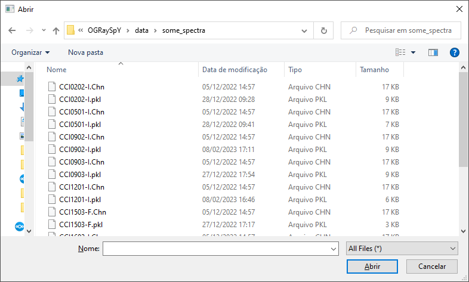
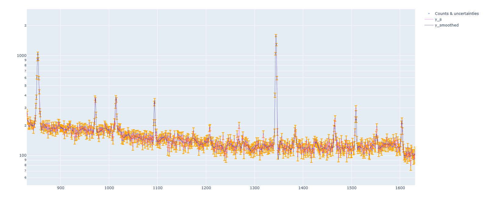
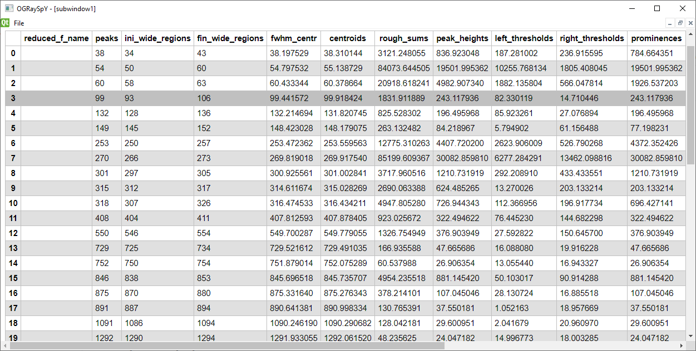
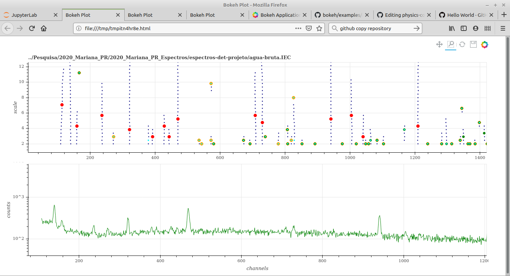

# OGRaySpY
An Open app for Gamma-RAY SPectra Analysis and visualization.

## Setting Up

This application requires:
- [Pandas](http://pandas.pydata.org/) for results reporting.
- [Plotly](https://plotly.com/python/) for spectra interactive graphing
- PyQt5 for UI
- numpy/scipy/lmfit to perform all the Math...

## Basic usage

- Run ograyspy_main_ui.py in a Python console to start main program's interface
- Invoke menu File --> Open spectrum and generate report
- Choose a .chn or .iec spectrum
- Peak report will be shown and saved as an_html_file.html.

## Documentation

- Under development at [Read the Docs](https://ograyspy-docs.readthedocs.io)

## Screenshots

### Open spectrum dialog

(Real) spectra as .chn files are in folder data/some_spectra:
</img>

### Gross counts graph

Zoomed window from a random spectrum:
</img>

### Peak report

Report as an html table:

</img>

### Old screenshots
#### Spectrum window with CWT ridges (will be ported soon):
</img>
