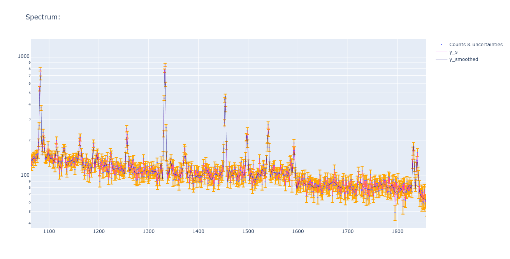

# OGRaySpY
An Open app for Gamma-RAY SPectra Analysis and visualization.

## Setting Up

This application requires:
- [Pandas](http://pandas.pydata.org/) for results reporting.
- [Plotly](https://plotly.com/python/) for spectra interactive graphing
- numpy, scipy, lmfit to perform all the Math.

## Documentation

- Under development at [Read the Docs](https://ograyspy-docs.readthedocs.io/en/latest/index.html)

## Screenshots

### Gross counts graph

Zoomed window from a random spectrum:
</img>

